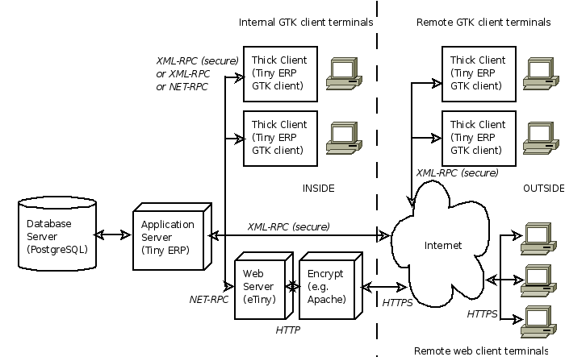

.. index::
   single: Open ERP architecture
.. 

.. index:: Architecture

The architecture of Open ERP OpenERP的结构
"""""""""""""""""""""""""""""

To access Open ERP you can:

你可以通过以下途径来使用 OpenERP：

* use a web browser pointed at the eTiny web server, or

* 通过浏览器来登陆eTiny web服务器，或者

* use an application client (the GTK client) installed on each computer.

* 通过安装在客户PC上的客户端应用程序(GTK客户端)

The two methods of access give very similar facilities, and you can use both on
the same server at the same time. It's best to use the web browser if the
Open ERP server is some distance away (such as on another continent) because
it's more tolerant of time delays between the two than the GTK client is. The
web client is also easier to maintain, because it's generally already installed
on users' computers.

两种方式同样便利，你可以通过两种方式来同时登陆同一台服务器。如果你和OpenERP的服务器距离很远（如跨洲），建议使用web服务器，因为这样可以降网络延迟带来的影响。web客户端（浏览器）也更容易维护，通常用户的计算机都已经安装好了浏览器。

Conversely you'd be better off with the application client (called the GTK
client because of the technology it's built with) if you're using a local
server (such as in the same building). In this case the GTK client will be more
responsive, so more satisfying to use.

相反，如果你的服务器在局域网内，你最好使用客户端应用程序（称其为GTK客户端是因为该客户端是采用GTK技术进行设计开发的）。在这种情况下，GTK客户端能够更快地响应操作，能更好地满足用户需求。

.. index::
   single: Client
..
   
.. tip::   **Usability**  *Web client and GTK client Web客户端和GTK客户端* 

    The main functional difference between the two Open ERP clients is the
    presence of the calendar view in the web client, which doesn't exist in the
    GTK client at present (versions 4.x and 5.0). Apart from that you will find that
    there are small differences in their general usability.

    二者功能上最主要的差别在于web客户端有日期控件而GTK客户端没有（无论4.x还是5.0版本）。除此之外，二者在正常使用过程中没有多少差别。

    The Tiny company will continue to support two clients for the foreseeable
    future, so you can use whichever client you prefer.

    Tiny公司会在可以预期的未来里对两种客户端进行支持，因此你可以选择自己喜欢的来使用。

An Open ERP system is formed by three main components:

一套OpenERP系统主要由三部分组成：

* the PostgreSQL database server, which contains all of the databases, each of which contains all data and most elements of the Open ERP system configuration,

* PostgreSQL数据库服务器，它存放着所有的数据库，每个数据库又存储着全部的数据和OpenERP系统的配置信息，

* the Open ERP application server, which contains all of the enterprise logic and ensures that Open ERP runs optimally,

* OpenERP应用程序服务器，它包含所有的企业业务逻辑，并保证OpenERP正常运行，

* the web server, a separate application called eTiny, which enables you to connect to Open ERP from standard web browsers and is not needed when you connect using a GTK client.

* 一个独立的称作eTiny的web服务器，eTiny可以让你通过标准的web浏览器来使用OpenERP。或者你也可以通过GTK客户端来实现同样的目的。

.. tip::   **Terminology**  *eTiny – server or client? eTiny 是服务器还是客户端？* 

    The eTiny component can be thought of as a server or a client depending on
    your viewpoint.

    eTiny是服务器还是客户端完全取决于你的看法。

    It acts as a web server to an end user connecting from a web browser, but
    it also acts as a client to the Open ERP application server just as a GTK
    application client does.

    当你用web浏览器连接eTiny时，eTiny就是一个服务器，但是它同时又扮演者客户端的角色来连接OpenERP的应用程序服务器，就像GTK客户端一样。

    So in this book its context will determine whether eTiny is referred to as
    a server or a client.

    因此，本书中会视环境来决定eTiny指的是客户端或是服务器。

.. index::
   single: eTiny
.. 

.. tip::   **Attention**  *eTiny* 

    At present, the web component is known as “eTiny”. Although it's possible
    that this application's name will change in the coming months to match the
    renaming of Tiny ERP to Open ERP, its characteristics will stay the same.

    当前，web部分被称作eTiny。虽然eTiny有可能会随着TinyERP向OpenERP更名而更名，但它的特性不会改变。

.. index::
   single: PostgreSQL
.. 

.. tip::   **Program**  *PostgreSQL* 

	PostgreSQL is a relational and object database management system.

        PostgreSQL是一款支持关系和面向对象的数据库管理系统。

    It's a free high-performance system that compares with other database
    management systems such as MySQL and FirebirdSQL (both free), Sybase, DB2
    and Microsoft SQL Server (all proprietary). It runs on all types of
    Operating System, from Unix/Linux to the various releases of Windows, via
    Mac OS X, Solaris, SunOS and BSD.

    和其他的数据库管理系统，如免费的MySQL、FirebirdSQL，以及Sybase,DB2,微软SQL S    erver，PostgreSQL拥有更好的表现，它是免费的。它可以运行在所有的操作系统之上     ，例如Unix/Linux，所有发行的Windows，Mac OS X,Solaris,SunOS和BSD。

These three components can be installed on the same server or can be
distributed onto separate computer servers if performance considerations
require it.

这三个组成部分可以安装在同一台服务器上，也可以根据性能需求分别安装在不同的机器上。

If you choose to run only with GTK clients you won't need the third component –
the eTiny server – at all. In this case Open ERP's GTK client must be installed
on the workstation of each Open ERP user in the company.

如果你选择使用GTK客户端，你就不需要安装第三部分eTiny。在这种情况下，必须将GTK客户端安装在每一个用户的机器上。

.. Copyright © Open Object Press. All rights reserved.

.. You may take electronic copy of this publication and distribute it if you don't
.. change the content. You can also print a copy to be read by yourself only.

.. We have contracts with different publishers in different countries to sell and
.. distribute paper or electronic based versions of this book (translated or not)
.. in bookstores. This helps to distribute and promote the Open ERP product. It
.. also helps us to create incentives to pay contributors and authors using author
.. rights of these sales.

.. Due to this, grants to translate, modify or sell this book are strictly
.. forbidden, unless Tiny SPRL (representing Open Object Presses) gives you a
.. written authorisation for this.

.. Many of the designations used by manufacturers and suppliers to distinguish their
.. products are claimed as trademarks. Where those designations appear in this book,
.. and Open ERP Press was aware of a trademark claim, the designations have been
.. printed in initial capitals.

.. While every precaution has been taken in the preparation of this book, the publisher
.. and the authors assume no responsibility for errors or omissions, or for damages
.. resulting from the use of the information contained herein.

.. Published by Open ERP Press, Grand Rosière, Belgium

